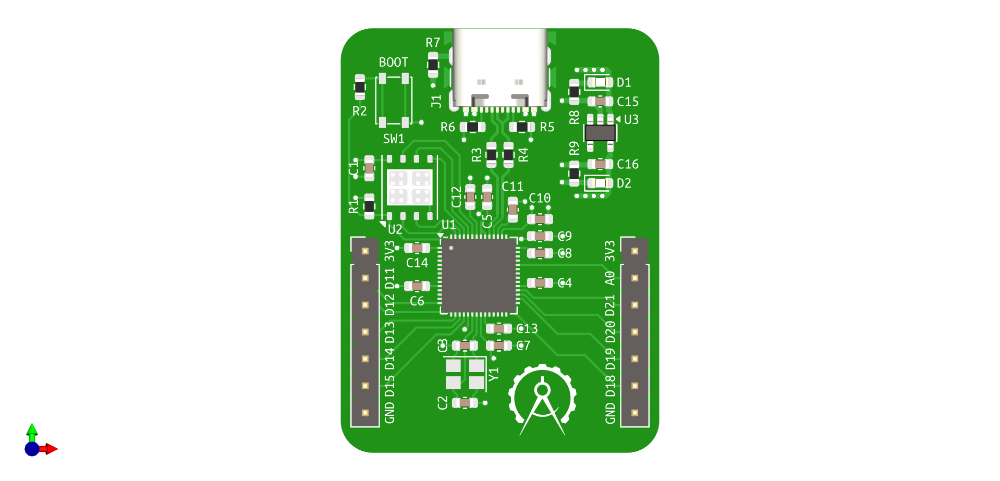
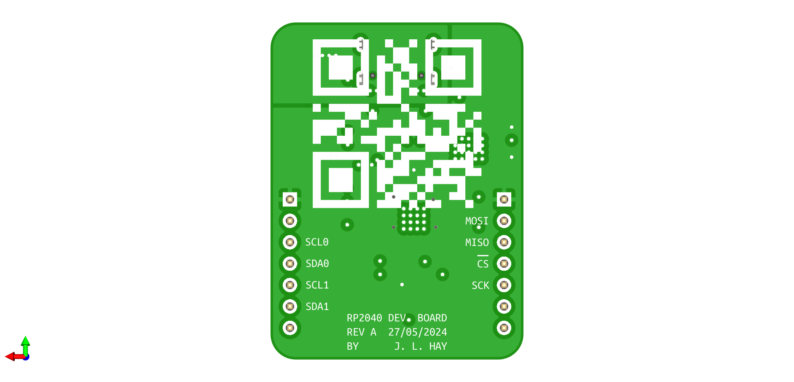
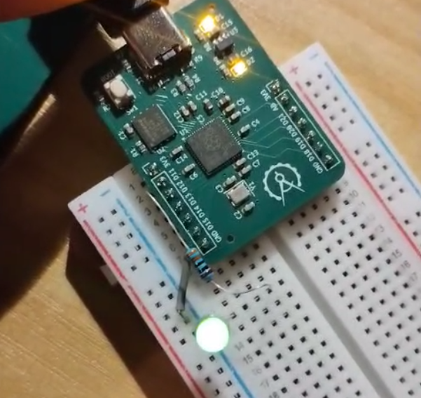

# RP2040 Dev. Board

This repository contains a development board design for the RP2040 loosely 
based around the Pi Pico. 

The goal of this design was to produce a development board for a common 
microcontroller for the purpose of demonstrating a simple PCB design. The 
design had to be breadboard compatible and use USB-C for programming. 

The designed board (as shown below) fulfills all of these requirements.

The board was manufactured and assembled by JLCPCB, and used to blink an LED
to demonstrate it is in working condition (shown below).

The design of the board could be improved by increasing pin count and 
reducing the width of the PCB to allow more room for breadboarding around
the board.
